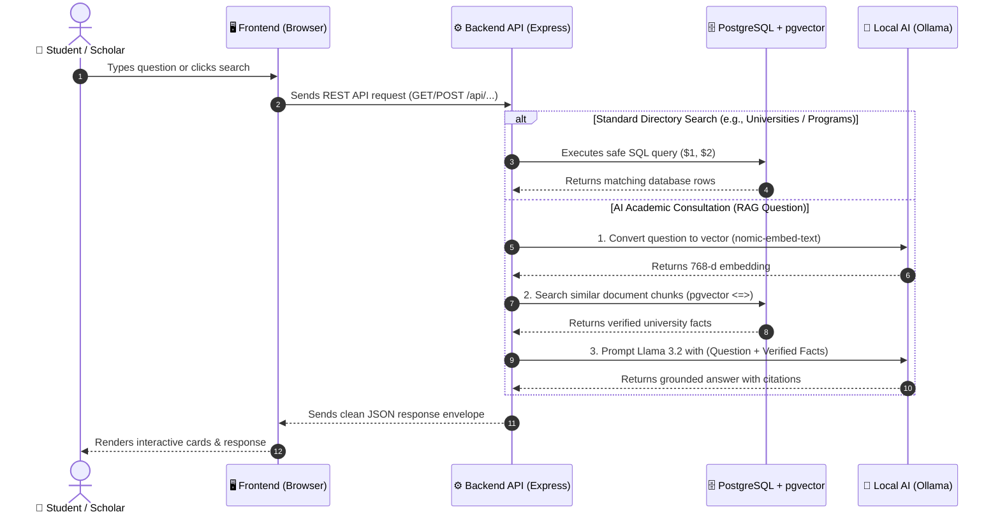

# GIBIConnect System Architecture & Engineering Guide

Welcome to **GIBIConnect**! This document provides an exhaustive, beginner-friendly, and technically accurate guide to the architecture, data flows, components, and codebase of the GIBIConnect platform.

Whether you are a backend engineer, frontend developer, AI/ML specialist, or database administrator, this guide will help you understand how every piece of the system works together.

---

## Table of Contents

1. [Project Overview](#1-project-overview)
2. [Architecture at a Glance](#2-architecture-at-a-glance)
3. [System Architecture Style](#3-system-architecture-style)
4. [Repository & Directory Structure](#4-repository--directory-structure)
5. [Frontend Architecture](#5-frontend-architecture)
6. [Backend Architecture](#6-backend-architecture)
7. [Database & ER Architecture](#7-database--er-architecture)
8. [AI & Grounded RAG Architecture](#8-ai--grounded-rag-architecture)
9. [Resource & Document Processing Architecture](#9-resource--document-processing-architecture)
10. [Authentication & Authorization](#10-authentication--authorization)
11. [API Specification & Endpoints](#11-api-specification--endpoints)
12. [End-to-End Data Flow Examples](#12-end-to-end-data-flow-examples)
13. [Feature-to-Code Mapping](#13-feature-to-code-mapping)
14. [Developer Navigation Guide ("If You Need to Change X, Go Here")](#14-developer-navigation-guide)
15. [Deployment Architecture](#15-deployment-architecture)
16. [Environment Variables Reference](#16-environment-variables-reference)
17. [Security Architecture](#17-security-architecture)
18. [Error Handling & Logging](#18-error-handling--logging)
19. [Testing Architecture](#19-testing-architecture)
20. [Current Architecture vs. Future Roadmap](#20-current-architecture-vs-future-roadmap)
21. [Architectural Decision Records (ADRs)](#21-architectural-decision-records-adrs)
22. [Technical Glossary](#22-technical-glossary)
23. [New Developer Onboarding & Quick Start](#23-new-developer-onboarding--quick-start)
24. [Engineering Rules for Contributors](#24-engineering-rules-for-contributors)

---

## 1. Project Overview

### What is GIBIConnect?

**GIBIConnect** is a centralized digital information directory and AI-powered academic advisory platform built specifically for the **Ethiopian Higher Education ecosystem**.

In Ethiopia, prospective university students, enrolled scholars, and researchers frequently struggle with fragmented academic data. Information about university accreditations, regional campuses, degree program prerequisites, tuition fee schedules, scholarship grants, and departmental curricula is scattered across disparate notices, social media groups, and outdated institutional websites.

### Who Uses the System?

1. **Prospective & Enrolled Students**: Discover accredited Ethiopian universities, explore undergraduate and graduate degree programs, review official admission criteria, download academic study materials, and ask personalized educational questions.
2. **Scholars & Faculty Members**: Share and download academic lecture notes, exam guidelines, and research publications.
3. **Institutional Administrators & Moderators**: Verify institution data, curate program curricula, and moderate user-uploaded educational resources.

### What Does the AI Component Do?

Unlike generic chatbots that hallucinate or provide generic answers, GIBIConnect features a **Grounded Retrieval-Augmented Generation (RAG)** system. When a student asks a question (e.g., _"What are the admission requirements for Software Engineering at Addis Ababa University?"_), the AI does not guess. Instead, it mathematically searches verified academic documents and institutional records in the PostgreSQL database, retrieves the exact context, and uses **Llama 3.2** to generate an accurate, factual response with explicit citations.

---

## 2. Architecture at a Glance

To understand GIBIConnect easily, think of it as **4 main building blocks** working together:

```
+-----------------------------------------------------------------------------------+
| 1. THE FRONTEND (The Face)                                                        |
| What the student sees in their browser (HTML5, Tailwind CSS, JavaScript).         |
+-----------------------------------------------------------------------------------+
                                       │
                                       │ 1. Sends HTTP request (e.g. "Search Jimma")
                                       ▼
+-----------------------------------------------------------------------------------+
| 2. THE BACKEND API (The Brain & Traffic Controller)                               |
| Node.js & Express server. Receives requests, checks login tokens, validates data, |
| and decides what data to fetch or which AI model to call.                         |
+-----------------------------------------------------------------------------------+
                    │                                             │
                    │ 2A. Reads / writes                          │ 2B. Asks for
                    │     academic records                        │     AI embeddings & answer
                    ▼                                             ▼
+---------------------------------------+     +-------------------------------------+
| 3. POSTGRESQL DATABASE (The Memory)   |     | 4. OLLAMA AI ENGINE (The Advisor)   |
| Stores universities, programs, users, |     | Local AI running:                   |
| scholarships, and vector embeddings   |     | • nomic-embed-text (Search vectors) |
| for RAG search (using pgvector).      |     | • llama3.2 (Text generation)        |
+---------------------------------------+     +-------------------------------------+
```

### Simplified Flow Diagram



### How the Parts Connect (In Plain English):

1. **Frontend to Backend**: The web browser **never** talks directly to PostgreSQL or Ollama. It only talks to the Backend API using standard web requests (`/api/...`).
2. **Backend to PostgreSQL**: The backend holds a pool of database connections (`pg.Pool`) and runs parameterized SQL queries so the database is safe from SQL injection attacks.
3. **Backend to Ollama AI**: When a student asks the AI a question, the backend retrieves verified facts from PostgreSQL first, bundles them into context, and sends them to Llama 3.2 via Ollama's local HTTP API (`http://ollama:11434`).
4. **Backend to Frontend**: The backend wraps the final answer into a standard JSON envelope (`{ success: true, data: [...] }`) and sends it back to the user's screen.

---

## 3. System Architecture Style

GIBIConnect is structured as a **Decoupled Client-Server Layered Modular Monolith**.

### Why This Classification?

1. **Decoupled Client-Server**: The frontend is a static, lightweight collection of HTML5, CSS3, and modern Vanilla ES6 modules served by the Express web server. The frontend and backend communicate exclusively via JSON over HTTP.
2. **Layered Architecture**: The backend strictly separates concerns into distinct architectural tiers:
   - **Presentation / Route Layer**: Defines API endpoints and URL parameters.
   - **Middleware Layer**: Enforces authentication, role checks, and Joi payload validation.
   - **Controller Layer**: Handles HTTP requests, parameter extraction, and standardized HTTP responses.
   - **Service Layer**: Implements core business logic, RAG retrieval orchestration, and token generation.
   - **Repository / Data Access Layer**: Encapsulates raw SQL queries and interacts directly with PostgreSQL.
3. **Modular Monolith**: All domain features (Institutions, Programs, Scholarships, Admissions, Resources, AI) live within a single cohesive backend codebase, sharing the database connection pool and middleware while maintaining domain isolation.

---

## 4. Repository & Directory Structure

```
C:\Users\hp\GIBIConnect\
├── frontend/                         # Client-Side Application Tier
│   ├── pages/                        # Individual HTML pages
│   │   ├── index.html                # Platform landing & introduction
│   │   ├── login.html                # Scholar authentication (Sign In & Register)
│   │   ├── explore.html              # Discovery hub & live feed
│   │   ├── institutions.html         # University directory & regional filter catalog
│   │   ├── institution.html          # Single university detail & sub-tab hub
│   │   ├── programs.html             # Degree programs directory
│   │   ├── program.html              # Single degree program curriculum view
│   │   ├── admissions.html           # Nationwide admissions criteria & deadlines
│   │   ├── admission.html            # Individual admission policy details
│   │   ├── scholarships.html         # Scholarship grants & financial aid hub
│   │   ├── scholarship.html          # Individual scholarship grant details
│   │   ├── resources.html            # Academic resource repository & stream preview
│   │   ├── profile.html              # Scholar workspace & bookmarked favorites
│   │   ├── admin.html                # Administrator & moderation console
│   │   └── ai-advisor.html           # Grounded RAG AI Academic Counselor
│   ├── js/                           # Frontend JavaScript ES6 Modules
│   │   ├── core/                     # Core services (API client, navigation, theme)
│   │   │   ├── api.js                # Centralized Fetch API client
│   │   │   ├── navigation.js         # Mobile drawer, search modal, navbar controller
│   │   │   └── theme.js              # Dark/Light theme state manager
│   │   ├── auth/auth.js              # Client authentication & JWT session storage
│   │   ├── institutions/             # University directory & profile logic
│   │   ├── programs/                 # Program listing & curriculum logic
│   │   ├── admissions/               # Admission requirement filter logic
│   │   ├── scholarships/             # Scholarship listing & filter logic
│   │   ├── resources/                # Resource download & in-page stream preview logic
│   │   ├── profile/                  # Saved bookmarks tab switcher logic
│   │   ├── admin/                    # User management & moderation queue logic
│   │   ├── explore/                  # Live feed search & aggregate loaders
│   │   └── ai/ai-advisor.js          # RAG consultation chat interface logic
│   ├── css/                          # Domain-Scoped Stylesheets
│   │   ├── global.css                # Core design tokens, dark mode variables, resets
│   │   ├── auth.css                  # Login & registration layout styling
│   │   ├── institutions.css          # University card grids & hero banner styles
│   │   ├── programs.css              # Curriculum cards & degree badge styling
│   │   ├── admissions.css            # Criteria checklists & calendar timelines
│   │   ├── scholarships.css          # Grant tags & funding badge styling
│   │   ├── resources.css             # Document cards & stream viewer modal styles
│   │   ├── profile.css               # Scholar stats & bookmark tab styling
│   │   ├── admin.css                 # Admin moderation tables & role selects
│   │   └── ai.css                    # Chat message bubbles & citation card styles
│   └── assets/                       # Static media, icons, and branding
│       ├── images/                   # University covers, facility photos
│       ├── icons/                    # UI icons and glyphs
│       └── logos/                    # Verified institution & GIBI logos
│
├── backend/                          # Server-Side Application Tier (Node.js / Express)
│   ├── src/
│   │   ├── config/                   # Configuration adapters
│   │   │   ├── database.js           # PostgreSQL connection pool (pg.Pool)
│   │   │   └── env.js                # Environment variable loader & fallbacks
│   │   ├── controllers/              # HTTP Request/Response controllers
│   │   │   ├── auth.controller.js
│   │   │   ├── institutions.controller.js
│   │   │   ├── programs.controller.js
│   │   │   ├── admissions.controller.js
│   │   │   ├── scholarships.controller.js
│   │   │   ├── resources.controller.js
│   │   │   ├── ai.controller.js
│   │   │   └── ...
│   │   ├── middleware/               # Express middleware functions
│   │   │   ├── auth.middleware.js    # JWT verification & RBAC authorize()
│   │   │   ├── validation.middleware.js # Joi payload validator
│   │   │   └── error.middleware.js   # Centralized error handler
│   │   ├── repositories/             # Data access layer (Parameterized SQL queries)
│   │   │   ├── users.repository.js
│   │   │   ├── institutions.repository.js
│   │   │   ├── programs.repository.js
│   │   │   ├── admissions.repository.js
│   │   │   ├── scholarships.repository.js
│   │   │   ├── resources.repository.js
│   │   │   ├── ai.repository.js
│   │   │   └── ...
│   │   ├── routes/                   # API Route declarations
│   │   │   ├── auth.routes.js        # /api/auth
│   │   │   ├── users.routes.js       # /api/users
│   │   │   ├── institutions.routes.js# /api/institutions
│   │   │   ├── programs.routes.js    # /api/programs
│   │   │   ├── admissions.routes.js  # /api/admissions
│   │   │   ├── scholarships.routes.js# /api/scholarships
│   │   │   ├── resources.routes.js   # /api/resources
│   │   │   ├── ai.routes.js          # /api/ai
│   │   │   └── index.js              # Master router aggregator
│   │   ├── services/                 # Business logic & integrations
│   │   │   ├── auth.service.js       # Password hashing & JWT generation
│   │   │   ├── ai.service.js         # RAG pipeline, context builder & LLM orchestration
│   │   │   └── storage/              # Local / cloud storage adapter
│   │   │       └── storage.service.js# File streaming & download delivery
│   │   ├── validators/               # Joi request validation schemas
│   │   │   ├── auth.validator.js
│   │   │   └── ...
│   │   ├── utils/                    # Shared response formatters & helpers
│   │   │   └── response.js           # Standardized JSON response envelope
│   │   ├── app.js                    # Express application setup, CORS, static server
│   │   └── server.js                 # HTTP server entrypoint
│   ├── database/                     # Backend-specific seeds & schema copies
│   │   └── seeds/seed.sql            # Master database seed file
│   ├── tests/                        # Automated test suites
│   │   ├── auth.test.js              # Authentication integration tests
│   │   ├── institutions.test.js      # University directory tests
│   │   └── resources.test.js         # Document download & stream tests
│   ├── package.json                  # Node.js dependencies & scripts
│   └── .env                          # Local development environment configuration
│
├── database/                         # Canonical Database Source of Truth
│   ├── schema/                       # Modular DDL table schemas (00 to 37)
│   │   ├── 00_prerequisites.sql      # UUID & pgvector extensions
│   │   ├── 01_enums.sql              # ENUM types (institution_type, degree_level, etc.)
│   │   ├── 02_institutions.sql       # Institutions table
│   │   ├── ...                       # Faculties, departments, programs, admissions
│   │   └── 36_rag_document_chunks.sql# pgvector chunk tables
│   ├── migrations/                   # Incremental schema migration scripts
│   ├── seeds/                        # Realistic sample data files
│   └── verification/                 # Database integrity verification scripts
│
├── docs/                             # Project Architecture Documentation & Guides
├── Dockerfile                        # Multi-stage container definition
├── docker-compose.yml                # Multi-service container orchestration
├── README.md                         # Project overview and quick start guide
└── package.json                      # Monorepo root workspace configuration
```

---

## 5. Frontend Architecture

### Technology Stack

- **Markup**: Semantic HTML5 with accessible ARIA tags.
- **Styling**: Tailwind CSS (loaded via CDN with container-queries and forms plugins) + Scoped CSS Modules.
- **JavaScript**: Modern ES6+ JavaScript modules (`type="module"`), native `fetch()`, `async`/`await`.
- **State Management**: Client-side `localStorage` for JWT auth session (`gibi_token`), user profile (`gibi_user`), and theme state (`gibi_theme`).

### Client-Side Request Flow

```
User Action (Click Search / Filter / Tab)
         │
         ▼
Page View Controller (e.g., js/institutions.js)
         │
         ▼
Central API Client (js/api.js -> fetchAPI())
         │  (Automatically attaches `Authorization: Bearer <token>` if authenticated)
         ▼
HTTP Request to Backend (/api/...)
         │
         ▼
JSON Response Envelope Received ({ success: true, data: [...] })
         │
         ▼
Dynamic DOM Rendering & State Update
```

### Key Frontend Controllers

1. **`js/api.js`**: The single source of truth for all HTTP communication with the backend. Exposes methods like `getInstitutions()`, `getPrograms()`, `getUserSavedItems()`, `saveInstitution()`, and `sendAIChat()`.
2. **`js/navigation.js`**: Controls the responsive global header, auto-injects the mobile slide-out hamburger drawer, manages the command search drawer, and renders user profile badges.
3. **`js/theme.js`**: Manages Dark and Light mode switching, saving the user's preference to `localStorage`.

---

## 6. Backend Architecture

### Technology Stack

- **Runtime**: Node.js (v18+)
- **Web Framework**: Express.js (v4.19+)
- **Database Driver**: `pg` (node-postgres v8.12+)
- **Authentication**: `jsonwebtoken` (JWT) + `bcryptjs` (salt rounds 10)
- **Validation**: `joi` (v17.13+)
- **Security & Utility**: `cors`, `morgan`, `dotenv`

### Request Lifecycle

```
Incoming HTTP Request (e.g., GET /api/institutions?region=Oromia)
         │
         ▼
[Express Server: app.js] (JSON Body Parser, CORS, Morgan Logger)
         │
         ▼
[Middleware: auth.middleware.js] (Extracts & verifies Bearer JWT, assigns req.user)
         │
         ▼
[Middleware: validation.middleware.js] (Validates query/body with Joi Schema)
         │
         ▼
[Route: routes/institutions.routes.js] (Routes URL to controller handler)
         │
         ▼
[Controller: controllers/institutions.controller.js] (Extracts params, invokes service/repo)
         │
         ▼
[Repository: repositories/institutions.repository.js] (Executes parameterized SQL via pg.Pool)
         │
         ▼
[PostgreSQL Database] (Returns relational records)
         │
         ▼
[Utility: utils/response.js] (Formats standard successResponse envelope)
         │
         ▼
HTTP 200 JSON Response Sent to Client
```

---

## 7. Database & ER Architecture

GIBIConnect runs on **PostgreSQL 16** with the **`pgvector`** extension enabled.

### Database Groups & Entities

```
+------------------------------------------------------------------------------------+
|                                 1. IDENTITY & ACCESS                               |
+------------------------------------------------------------------------------------+
| users (id, email, password_hash, full_name, role, status, created_at)             |
|   ├── role: ENUM ('user', 'moderator', 'admin')                                    |
|   └── status: ENUM ('active', 'suspended', 'pending')                              |
+------------------------------------------------------------------------------------+

+------------------------------------------------------------------------------------+
|                          2. INSTITUTIONS & DEPARTMENTS                             |
+------------------------------------------------------------------------------------+
| institutions (id, name, slug, description, type, ownership, city, region, ...)     |
|   ├── faculties (id, institution_id, name, description)                            |
|   │     └── departments (id, faculty_id, name, description)                        |
|   ├── facilities (id, institution_id, name, category, description)                 |
|   └── academic_calendar (id, institution_id, academic_year, semester, events)      |
+------------------------------------------------------------------------------------+

+------------------------------------------------------------------------------------+
|                          3. ACADEMIC PROGRAMS & ADMISSIONS                         |
+------------------------------------------------------------------------------------+
| programs (id, institution_id, department_id, name, degree_level, duration, ...)    |
|   ├── admissions (id, institution_id, program_id, degree_level, requirements, ...) |
|   └── tuition_fees (id, institution_id, program_id, amount, period, ...)           |
+------------------------------------------------------------------------------------+

+------------------------------------------------------------------------------------+
|                          4. SCHOLARSHIPS & FINANCIAL AID                           |
+------------------------------------------------------------------------------------+
| scholarships (id, name, slug, funding, deadline, eligibility, description, ...)    |
|   └── institution_scholarships (institution_id, scholarship_id)                    |
+------------------------------------------------------------------------------------+

+------------------------------------------------------------------------------------+
|                          5. ACADEMIC RESOURCES & BOOKMARKS                         |
+------------------------------------------------------------------------------------+
| resources (id, title, description, file_extension, file_size_bytes, storage_key)   |
|   ├── saved_institutions (user_id, institution_id, created_at)                     |
|   ├── saved_programs (user_id, program_id, created_at)                             |
|   ├── saved_scholarships (user_id, scholarship_id, created_at)                     |
|   └── resource_bookmarks (user_id, resource_id, created_at)                        |
+------------------------------------------------------------------------------------+

+------------------------------------------------------------------------------------+
|                           6. AI & RAG VECTOR KNOWLEDGE                             |
+------------------------------------------------------------------------------------+
| ai_conversations (id, user_id, institution_id, title, created_at)                  |
|   └── ai_messages (id, conversation_id, sender, content, metadata, created_at)     |
|                                                                                    |
| rag_document_chunks (id, resource_id, institution_id, chunk_text, embedding)       |
|   └── embedding: vector(768) [Cosine Distance Index]                               |
+------------------------------------------------------------------------------------+
```

### Relational Constraints & Data Integrity

- **Primary Keys**: Every entity uses a UUID (`uuid_generate_v4()`) for unique distributed identification.
- **Foreign Keys**: Strict referential integrity (`ON DELETE CASCADE` on child entities; `ON DELETE RESTRICT` on institutions).
- **Enum Types**: Used for controlled vocabularies (`institution_type`, `ownership_type`, `degree_level`, `user_role`).

---

## 8. AI & Grounded RAG Architecture

The GIBIConnect AI system provides accurate academic counseling strictly grounded in verified institutional data.

```
========================================================================================
                              AI / RAG COMPLETE DATAFLOW
========================================================================================

PHASE 1: DOCUMENT INGESTION & VECTOR INDEXING (Offline/Admin Pipeline)
   [ Official University Policy / Curriculum PDF / Brochure ]
                               │
                               ▼
   [ Text Extraction & Normalization (storage.service.js) ]
                               │
                               ▼
   [ Semantic Chunking (512 tokens with 100 token overlap) ]
                               │
                               ▼
   [ Embedding Model: nomic-embed-text via Ollama API ]
                               │ (Generates 768-dimensional dense vector)
                               ▼
   [ INSERT INTO rag_document_chunks (chunk_text, metadata, embedding) ]

----------------------------------------------------------------------------------------

PHASE 2: REAL-TIME INQUIRY & GROUNDED GENERATION (User Interaction)
   [ Student Inquiry: "What degree programs are offered at ASTU in Engineering?" ]
                               │
                               ▼
   [ Backend API Endpoint: POST /api/ai/chat (ai.service.js) ]
                               │
                               ▼
   [ Question Embedding: nomic-embed-text generates 768-d Query Vector ]
                               │
                               ▼
   [ pgvector Similarity Search + Relational Filter ]:
     SELECT chunk_text, institution_id
     FROM rag_document_chunks
     WHERE institution_id = $1
     ORDER BY embedding <=> $2
     LIMIT 4;
                               │
                               ▼
   [ Context Assembly ]:
     Assembles retrieved verified chunks into an immutable [GROUNDING CONTEXT] block.
                               │
                               ▼
   [ LLM Inference: Llama 3.2 via Ollama ]:
     System Prompt: "You are the GIBIConnect Academic Advisor. Answer the student's question
     STRICTLY using the provided verified academic context. If unknown, state clearly."
                               │
                               ▼
   [ Response Delivered with Institutional Citations to Student UI ]
========================================================================================
```

---

## 9. Resource & Document Processing Architecture

GIBIConnect hosts official academic study guides, past exams, lecture notes, and university bulletins.

```
[ User / Faculty Upload ]
            │
            ▼
[ Joi Validation ] (Verifies mime_type, max 50MB size limit, valid metadata)
            │
            ▼
[ Storage Adapter: storage.service.js ] (Writes file to storage bucket / local disk)
            │
            ▼
[ PostgreSQL Record Created: resources table ] (Status: 'pending' for moderation)
            │
            ▼
[ Admin Review / Moderation ] (Admin inspects file and marks status: 'approved')
            │
            ▼
[ Document Delivery ]:
  ├── Stream Endpoint (GET /api/resources/:id/stream) -> Inline PDF preview in browser
  └── Download Endpoint (GET /api/resources/:id/download) -> Content-Disposition: attachment
```

---

## 10. Authentication & Authorization

GIBIConnect enforces a clean distinction between **Authentication** (_"Who are you?"_) and **Authorization** (_"What are you allowed to do?"_).

```
                      AUTHENTICATION FLOW (Login / Register)
   [ User enters Email & Password ]
                  │
                  ▼
   [ POST /api/auth/login ]
                  │
                  ▼
   [ Verify User via bcryptjs.compare(password, password_hash) ]
                  │
                  ▼
   [ Generate Signed JWT: jwt.sign({ id, email, role }, JWT_SECRET, { expiresIn: '7d' }) ]
                  │
                  ▼
   [ Client receives JWT and saves to localStorage('gibi_token') ]

----------------------------------------------------------------------------------------

                      AUTHORIZATION FLOW (Protected Routes)
   [ Client sends Request with Header: "Authorization: Bearer <JWT>" ]
                  │
                  ▼
   [ authenticate Middleware ]:
     Verifies cryptographic signature. If invalid/expired -> HTTP 401 Unauthorized.
                  │
                  ▼
   [ authorize('admin', 'moderator') Middleware ]:
     Checks if req.user.role matches allowed roles. If unauthorized -> HTTP 403 Forbidden.
                  │
                  ▼
   [ Controller Action Executed ]
```

---

## 11. API Specification & Endpoints

All API responses follow a standardized JSON envelope:

```json
{
  "success": true,
  "message": "Human readable summary",
  "data": { ... },
  "meta": { "timestamp": "2026-08-22T10:00:00.000Z" },
  "error": null
}
```

### Core API Reference

| Method   | Endpoint                            | Purpose                                                           | Auth Required? | Roles Allowed        |
| -------- | ----------------------------------- | ----------------------------------------------------------------- | -------------- | -------------------- |
| `POST`   | `/api/auth/register`                | Register a new student account                                    | No             | Public               |
| `POST`   | `/api/auth/login`                   | Authenticate with email & password                                | No             | Public               |
| `GET`    | `/api/auth/me`                      | Retrieve current authenticated user profile                       | **Yes**        | Any role             |
| `GET`    | `/api/institutions`                 | Search & list universities (supports `?q=`, `?region=`, `?type=`) | No             | Public               |
| `GET`    | `/api/institutions/:id`             | Get comprehensive single university profile                       | No             | Public               |
| `GET`    | `/api/programs`                     | Browse degree programs (supports `?degree_level=`, `?q=`)         | No             | Public               |
| `GET`    | `/api/programs/:id`                 | Get degree program details and curriculum                         | No             | Public               |
| `GET`    | `/api/admissions`                   | Get nationwide admission requirements                             | No             | Public               |
| `GET`    | `/api/scholarships`                 | Search financial aid and scholarships                             | No             | Public               |
| `GET`    | `/api/resources`                    | List academic resources & publications                            | No             | Public               |
| `GET`    | `/api/resources/:id/stream`         | Stream PDF for in-page modal preview                              | No             | Public               |
| `GET`    | `/api/resources/:id/download`       | Download academic document                                        | No             | Public               |
| `GET`    | `/api/users/me/saved`               | Get user's saved universities, programs, resources                | **Yes**        | Any role             |
| `POST`   | `/api/users/saved/institutions`     | Bookmark a university to scholar profile                          | **Yes**        | Any role             |
| `DELETE` | `/api/users/saved/institutions/:id` | Remove university from bookmarks                                  | **Yes**        | Any role             |
| `POST`   | `/api/ai/chat`                      | Submit consultation prompt to Grounded RAG AI                     | Optional       | Public / Scholar     |
| `GET`    | `/api/users`                        | List all registered users (Admin console)                         | **Yes**        | `admin`, `moderator` |
| `PATCH`  | `/api/users/:id/role`               | Change a user's role (`user`, `moderator`, `admin`)               | **Yes**        | `admin`              |
| `PATCH`  | `/api/resources/:id/approve`        | Approve a pending resource upload                                 | **Yes**        | `admin`, `moderator` |
| `PATCH`  | `/api/resources/:id/reject`         | Reject a pending resource upload                                  | **Yes**        | `admin`, `moderator` |

---

## 12. End-to-End Data Flow Examples

### Example A: Student Searches for a University

1. **User Action**: The student types `"Jimma"` in the search drawer in `explore.html`.
2. **Frontend**: `js/navigation.js` triggers `handleCategorizedSearch('Jimma')`, calling `getInstitutions({ q: 'Jimma', limit: 4 })` in `js/api.js`.
3. **Backend Route**: `routes/institutions.routes.js` receives `GET /api/institutions?q=Jimma&limit=4`.
4. **Controller & Repository**: `institutions.controller.js` invokes `institutions.repository.js`.
5. **Database Query**: PostgreSQL executes:
   ```sql
   SELECT * FROM institutions WHERE name ILIKE $1 OR city ILIKE $1 OR region ILIKE $1;
   ```
6. **Delivery**: The JSON result is rendered inside the slide-down search drawer with direct clickable links to `institution.html?id=...`.

### Example B: User Asks a Question to the Grounded AI

1. **User Action**: Student opens `ai-advisor.html` and submits: _"What are the admission rules for AAU Computer Science?"_.
2. **Frontend**: `js/ai-advisor.js` calls `sendAIChat(prompt, institutionId)` in `js/api.js`.
3. **Backend Service**: `ai.service.js` creates a conversation record in `ai_conversations`.
4. **Vector Embedding**: `ai.service.js` sends the prompt to Ollama's `/api/embeddings` using `nomic-embed-text`.
5. **pgvector Search**: The backend runs cosine distance retrieval against `rag_document_chunks`.
6. **Prompt Assembly**: The retrieved chunks are formatted into context:
   ```text
   Context from verified documents:
   - AAU Computer Science requires passing the Ethiopian University Entrance Exam...
   Question: What are the admission rules for AAU Computer Science?
   ```
7. **Inference**: Ollama executes `llama3.2` and generates the response.
8. **Storage & Delivery**: The message is saved to `ai_messages` and streamed back to the client interface.

---

## 13. Feature-to-Code Mapping

| Platform Feature          | Frontend Files                                                                                                                                                                             | Backend Route & Controller                                                  | Repository (SQL Layer)                                                       | Database Tables                                               |
| ------------------------- | ------------------------------------------------------------------------------------------------------------------------------------------------------------------------------------------ | --------------------------------------------------------------------------- | ---------------------------------------------------------------------------- | ------------------------------------------------------------- |
| **User Authentication**   | [`frontend/login.html`](file:///C:/Users/hp/GIBIConnect/frontend/login.html)<br>[`frontend/js/auth.js`](file:///C:/Users/hp/GIBIConnect/frontend/js/auth.js)                               | `routes/auth.routes.js`<br>`controllers/auth.controller.js`                 | `repositories/users.repository.js`                                           | `users`                                                       |
| **University Directory**  | [`frontend/institutions.html`](file:///C:/Users/hp/GIBIConnect/frontend/institutions.html)<br>[`frontend/js/institutions.js`](file:///C:/Users/hp/GIBIConnect/frontend/js/institutions.js) | `routes/institutions.routes.js`<br>`controllers/institutions.controller.js` | `repositories/institutions.repository.js`                                    | `institutions`, `institution_verification`                    |
| **University Detail Hub** | [`frontend/institution.html`](file:///C:/Users/hp/GIBIConnect/frontend/institution.html)<br>[`frontend/js/institution.js`](file:///C:/Users/hp/GIBIConnect/frontend/js/institution.js)     | `routes/institutions.routes.js`<br>`controllers/institutions.controller.js` | `repositories/institutions.repository.js`                                    | `faculties`, `departments`, `facilities`, `academic_calendar` |
| **Degree Programs**       | [`frontend/programs.html`](file:///C:/Users/hp/GIBIConnect/frontend/programs.html)<br>[`frontend/js/programs.js`](file:///C:/Users/hp/GIBIConnect/frontend/js/programs.js)                 | `routes/programs.routes.js`<br>`controllers/programs.controller.js`         | `repositories/programs.repository.js`                                        | `programs`, `departments`                                     |
| **Scholarships**          | [`frontend/scholarships.html`](file:///C:/Users/hp/GIBIConnect/frontend/scholarships.html)<br>[`frontend/js/scholarships.js`](file:///C:/Users/hp/GIBIConnect/frontend/js/scholarships.js) | `routes/scholarships.routes.js`<br>`controllers/scholarships.controller.js` | `repositories/scholarships.repository.js`                                    | `scholarships`, `institution_scholarships`                    |
| **Academic Resources**    | [`frontend/resources.html`](file:///C:/Users/hp/GIBIConnect/frontend/resources.html)<br>[`frontend/js/resources.js`](file:///C:/Users/hp/GIBIConnect/frontend/js/resources.js)             | `routes/resources.routes.js`<br>`controllers/resources.controller.js`       | `repositories/resources.repository.js`                                       | `resources`, `resource_downloads`                             |
| **Scholar Saved Items**   | [`frontend/profile.html`](file:///C:/Users/hp/GIBIConnect/frontend/profile.html)<br>[`frontend/js/profile.js`](file:///C:/Users/hp/GIBIConnect/frontend/js/profile.js)                     | `routes/users.routes.js`<br>`controllers/users.controller.js`               | `routes/users.routes.js`                                                     | `saved_institutions`, `saved_programs`, `resource_bookmarks`  |
| **Admin Console**         | [`frontend/admin.html`](file:///C:/Users/hp/GIBIConnect/frontend/admin.html)<br>[`frontend/js/admin.js`](file:///C:/Users/hp/GIBIConnect/frontend/js/admin.js)                             | `routes/users.routes.js`<br>`routes/resources.routes.js`                    | `repositories/users.repository.js`<br>`repositories/resources.repository.js` | `users`, `resources`                                          |
| **Grounded AI Advisor**   | [`frontend/ai-advisor.html`](file:///C:/Users/hp/GIBIConnect/frontend/ai-advisor.html)<br>[`frontend/js/ai-advisor.js`](file:///C:/Users/hp/GIBIConnect/frontend/js/ai-advisor.js)         | `routes/ai.routes.js`<br>`controllers/ai.controller.js`                     | `repositories/ai.repository.js`                                              | `ai_conversations`, `ai_messages`, `rag_document_chunks`      |

---

## 14. Developer Navigation Guide

### _"If You Need to Change X, Go Here:"_

- **Modify the visual layout of a page**:
  $\rightarrow$ Go to [`frontend/pages/<page_name>.html`](file:///C:/Users/hp/GIBIConnect/frontend/pages) or edit the scoped CSS in [`frontend/css/<domain>.css`](file:///C:/Users/hp/GIBIConnect/frontend/css).
- **Add a new API endpoint**:
  1. Define the route in `backend/src/routes/<domain>.routes.js`.
  2. Implement the controller handler in `backend/src/controllers/<domain>.controller.js`.
  3. Add the SQL query in `backend/src/repositories/<domain>.repository.js`.
  4. Expose the client method in `frontend/js/api.js`.
- **Update database tables or add a new column**:
  1. Create a migration script in `database/migrations/`.
  2. Update the canonical DDL schema in `database/` (the numbered SQL files).
  3. Update the matching repository query in `backend/src/repositories/`.
- **Adjust AI / RAG prompt behavior**:
  $\rightarrow$ Edit the system prompt and context assembly logic in `backend/src/services/ai.service.js`.
- **Change Authentication or Password validation rules**:
  $\rightarrow$ Edit Joi schemas in `backend/src/validators/auth.validator.js` and hashing logic in `backend/src/services/auth.service.js`.
- **Add a new university to initial development seed**:
  $\rightarrow$ Add the row in `database/seed.sql` and run the seed loader.

---

## 15. Deployment Architecture

### Current Development Environment

- **Web & API Server**: Node.js v18+ running on `http://localhost:5000`.
- **Database**: Local PostgreSQL 16 running on port `5432` with `pgvector` enabled.
- **AI Runtime**: Local Ollama daemon running on `http://localhost:11434` serving `llama3.2` and `nomic-embed-text`.
- **Containerization**: `docker-compose.yml` orchestrating the App, PostgreSQL, and Ollama containers.

### Recommended Production Deployment

- **Edge / Ingress**: Nginx reverse proxy with automated SSL certificate renewal (Let's Encrypt / Certbot).
- **Application Layer**: Stateless Docker container running the Node.js Express server.
- **Database Layer**: Managed PostgreSQL 16 instance with automated daily backups and `pgvector` extension.
- **Static Assets**: Frontend static files cached and delivered via CDN (Cloudflare / Fastly).

---

## 16. Environment Variables Reference

| Variable Name    | Default / Example Value  | Used By                  | Description                                                     | Required in Prod?     |
| ---------------- | ------------------------ | ------------------------ | --------------------------------------------------------------- | --------------------- |
| `PORT`           | `5000`                   | Backend (`server.js`)    | Port on which the Express HTTP server listens                   | Yes                   |
| `NODE_ENV`       | `development`            | Backend (`app.js`)       | Application environment (`development`, `production`, `test`)   | Yes                   |
| `DB_HOST`        | `localhost`              | Database (`database.js`) | PostgreSQL server hostname or container alias (`db`)            | Yes                   |
| `DB_PORT`        | `5432`                   | Database (`database.js`) | PostgreSQL server port                                          | Yes                   |
| `DB_USER`        | `postgres`               | Database (`database.js`) | PostgreSQL database username                                    | Yes                   |
| `DB_PASSWORD`    | `postgres`               | Database (`database.js`) | PostgreSQL database password                                    | Yes                   |
| `DB_NAME`        | `gibiconnect`            | Database (`database.js`) | PostgreSQL database name                                        | Yes                   |
| `DATABASE_URL`   | _(connection string)_    | Database (`database.js`) | Full connection URI (overrides individual DB\_\* fields if set) | Optional              |
| `JWT_SECRET`     | `super-secret-jwt-key`   | Auth (`auth.service.js`) | Secret key used for signing and verifying JWT bearer tokens     | **Yes (Must change)** |
| `JWT_EXPIRES_IN` | `7d`                     | Auth (`auth.service.js`) | Expiration duration for access tokens                           | Yes                   |
| `OLLAMA_HOST`    | `http://localhost:11434` | AI (`ai.service.js`)     | HTTP endpoint for local Ollama LLM and embedding service        | Yes                   |
| `PGPOOL_MAX`     | `20`                     | Database (`database.js`) | Maximum active connections maintained in PostgreSQL pool        | Optional              |

> [!CAUTION]
> Never commit `.env` files containing real production passwords or JWT secrets to Git. Always use `.env.example` as a template.

---

## 17. Security Architecture

### Implemented Security Controls

1. **Password Hashing**: Passwords are cryptographically salted and hashed using `bcryptjs` with 10 salt rounds. Plaintext passwords are never stored or logged.
2. **SQL Injection Defense**: 100% of database queries use parameterized numbered placeholders (`$1, $2, ...`), preventing malicious query injection.
3. **Stateless JWT Authorization**: Sensitive routes require cryptographically verified Bearer tokens.
4. **Role-Based Access Control (RBAC)**: Backend middleware strictly checks permissions (`admin`, `moderator`, `user`). Students attempting to invoke admin APIs receive HTTP `403 Forbidden`.
5. **Input Validation**: Joi schemas validate all user-submitted payloads (email format, password length, UUID structure) before reaching the controller.
6. **CORS Policy**: Configured in Express to restrict unauthorized cross-origin requests.

### Planned Future Security Enhancements

- Implementation of short-lived access tokens (15 minutes) paired with secure HTTP-only refresh tokens.
- Sliding-window API rate limiting backed by Redis.
- Automated dependency vulnerability scanning in CI pipelines (`npm audit` / Snyk).

---

## 18. Error Handling & Logging

GIBIConnect employs a centralized error handling architecture.

```
Controller / Service Throws Error (e.g., throw new Error('User not found'); err.statusCode = 404;)
                               │
                               ▼
[Express Centralized Error Middleware: error.middleware.js]
                               │
                               ▼
Logs Error Stack Trace to Console (Morgan / Winston Logger)
                               │
                               ▼
Sends Standardized JSON Error Response:
{
  "success": false,
  "message": "User not found",
  "data": null,
  "meta": { "timestamp": "..." },
  "error": {
    "code": "NOT_FOUND",
    "details": []
  }
}
```

---

## 19. Testing Architecture

GIBIConnect utilizes **Jest** and **Supertest** for automated test suites located in `backend/tests/`.

### Implemented Test Coverage

- **Authentication Suite (`auth.test.js`)**: Tests user registration, password hashing verification, login token issuance, and validation rejections for invalid email/password combinations.
- **Institutions Suite (`institutions.test.js`)**: Tests university list retrieval, regional filtering, search query handling, and single university detail loading.
- **Resources Suite (`resources.test.js`)**: Tests document metadata queries, PDF stream endpoints, attachment download headers, and moderation approvals.

### Running Tests

Execute the automated test suite from the backend directory:

```bash
cd backend
npm test
```

---

## 20. Current Architecture vs. Future Roadmap

| Architecture Dimension | Current Implementation                            | Future Production Roadmap                                                  |
| ---------------------- | ------------------------------------------------- | -------------------------------------------------------------------------- |
| **Caching Tier**       | Direct PostgreSQL queries with connection pooling | **Redis Caching Layer** for hot university lookups and question embeddings |
| **API Rate Limiting**  | Base middleware structure                         | **Redis Token Bucket Rate Limiting** against brute-force / DoS attacks     |
| **AI Inference**       | Synchronous Ollama execution                      | **Asynchronous Task Queue (BullMQ / RabbitMQ)** with dedicated GPU workers |
| **Document Storage**   | Local filesystem storage via `storage.service.js` | **Cloud Object Storage (Amazon S3 / Google Cloud Storage)**                |
| **Database Scaling**   | Single primary PostgreSQL instance                | **Read Replicas** for read-heavy public directory traffic                  |
| **CI/CD Pipeline**     | Local automated testing via Jest                  | **GitHub Actions CI/CD** with automated test runners and container builds  |

---

## 21. Architectural Decision Records (ADRs)

### ADR 1: Why PostgreSQL with `pgvector`?

- **Context**: GIBIConnect requires both structured relational data (universities, programs, admissions, scholarships) and semantic document search for its AI advisory engine.
- **Decision**: Adopt PostgreSQL 16 with the native `pgvector` extension.
- **Rationale**: Eliminates the cost and operational overhead of maintaining a separate standalone vector database (e.g., Pinecone/Milvus). Allows combining vector similarity searches with relational SQL filters in a single atomic query.

### ADR 2: Why Decoupled HTML/CSS/Vanilla JS Frontend?

- **Context**: Educational platforms in developing regions need high performance, rapid page load times, and minimal client-side bundle overhead.
- **Decision**: Implement the client using standard HTML5, modern Vanilla ES6 modules, and Tailwind CSS.
- **Rationale**: Zero client-side JavaScript compilation overhead, ultra-fast initial page loads on low-bandwidth connections, and straightforward deployment without complex frontend build pipelines.

### ADR 3: Why Retrieval-Augmented Generation (RAG)?

- **Context**: General-purpose LLMs lack localized, authoritative facts regarding Ethiopian university admissions and frequently hallucinate answers.
- **Decision**: Enforce a strict RAG retrieval pipeline before passing context to Llama 3.2.
- **Rationale**: Guarantees that the AI only answers based on verified academic records, providing real source attribution to students.

---

## 22. Technical Glossary

- **API (Application Programming Interface)**: A structured set of HTTP endpoints enabling communication between the frontend and backend.
- **REST (Representational State Transfer)**: The architectural style used by GIBIConnect APIs utilizing standard HTTP methods (`GET`, `POST`, `PATCH`, `DELETE`).
- **JWT (JSON Web Token)**: A compact, URL-safe token used to securely transmit authenticated user identity and roles.
- **pgvector**: An open-source extension for PostgreSQL that adds native support for vector embeddings and exact cosine similarity searches.
- **Embedding**: A mathematical representation of text as a dense vector of numbers (e.g., 768 dimensions) capturing semantic meaning.
- **RAG (Retrieval-Augmented Generation)**: The AI design pattern that retrieves relevant factual documents before generating an LLM response.
- **LLM (Large Language Model)**: The neural network (Llama 3.2) responsible for synthesizing natural language answers from retrieved context.
- **RBAC (Role-Based Access Control)**: Restricting access to sensitive features based on assigned roles (`user`, `moderator`, `admin`).
- **Connection Pool**: A cache of database connections maintained so that requests can reuse existing connections rather than opening new ones.

---

## 23. New Developer Onboarding & Quick Start

Follow these steps to set up GIBIConnect on your local development machine:

### 1. Prerequisites

Ensure you have the following installed:

- **Node.js** (v18 or higher)
- **PostgreSQL 16** with `pgvector` extension
- **Ollama** (optional, for local AI RAG features)

### 2. Clone Repository & Install Dependencies

```bash
git clone https://github.com/your-org/GIBIConnect.git
cd GIBIConnect/backend
npm install
```

### 3. Configure Environment

Create a `.env` file inside the `backend/` directory:

```env
PORT=5000
NODE_ENV=development
DB_HOST=localhost
DB_PORT=5432
DB_USER=postgres
DB_PASSWORD=postgres
DB_NAME=gibiconnect
JWT_SECRET=development-secret-key-change-me
JWT_EXPIRES_IN=7d
OLLAMA_HOST=http://localhost:11434
```

### 4. Initialize Database & Seed Data

```bash
# Connect to PostgreSQL and load the database seed
psql -U postgres -d gibiconnect -f database/seed.sql
```

### 5. Start the Server

```bash
# From the backend directory:
npm start

# Open your browser and navigate to:
# http://localhost:5000/explore.html
```

---

## 24. Engineering Rules for Contributors

1. **Strict Client-Server Boundary**: The frontend must never attempt direct database connections. All data access must pass through the backend REST API.
2. **Layer Isolation**: Keep controllers thin. HTTP validation belongs in middleware/validators, business logic belongs in services, and raw SQL queries belong strictly in repositories.
3. **100% Parameterized SQL**: Never concatenate variables into SQL strings. Always use numbered parameter placeholders (`$1, $2, ...`).
4. **Never Expose Secrets**: Never hardcode API keys, passwords, or JWT secrets in client files or committed code. Use environment variables.
5. **No AI Hallucinations**: When modifying AI services, ensure system prompts strictly instruct the LLM to ground answers in retrieved database context.
6. **Documentation Integrity**: When introducing new database tables, routes, or architectural changes, update `ARCHITECTURE.md` to keep documentation aligned with the codebase.
